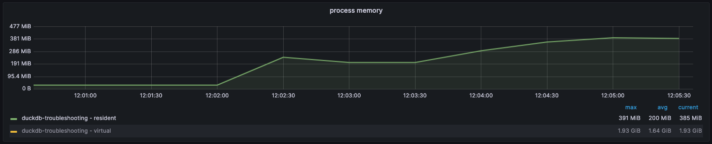

# Possible memory leak in [duckdb](https://github.com/duckdb/duckdb)

This repository contains minor applications written in golang and python with the purpose of replicating a 
possible memory leak in the [go-duckdb](https://github.com/marcboeker/go-duckdb) library and / or the underlying
[duckdb](https://github.com/duckdb/duckdb) library.

See [gh-81](https://github.com/marcboeker/go-duckdb/issues/81) for further details.

## Getting started
The application consists of a tiny api that will process each line of a parquet file from 
[NYC Yellow Taxi Trip Dataset](https://www.nyc.gov/site/tlc/about/tlc-trip-record-data.page) and print the total number of
processed rows. Even though this can be accomplished by a single `select count(*) from "data.parquet"` query, the
intention is to show what happens with the memory usage when you process large amount of rows from a parquet file.

```shell
# Golang based application
GET http://localhost:8090/query
{"total": 12345}

# Python based application
GET http://localhost:8090/query
{"total": 12345}
```

## Setup
In addition to the api, a Grafana instance with a pre-configured dashboards and a Prometheus instance are included for
easier troubleshooting.

### Download dataset
Download the dataset used for testing by running `make download`.

### Build on Linux
```shell
docker-compose build
docker-compose up
```

### Build on Apple Silicon
```shell
brew install lima
limactl start template://experimental/vz

limactl shell vz nerdctl compose build
limactl shell vz nerdctl compose up
```

## Reproduce
Open Grafana at http://localhost:3000 and login with `admin:password`. Locate the `General / Memory usage` dashboard
and monitor the process memory graph. When you see that data points have been registered you make a http request to
http://localhost:8090/query for the golang based application, or http://localhost:8080 for the python based application.
The request will go through each line in the parquet file and just increment a dummy counter.

```shell
# Golang based application
curl http://localhost:8090/query
# Python based application
curl http://localhost:8080
```

Make notice of the resident memory usage that increases and does not fall after the garbage collection. Do repetitive http
requests and notice that for each time the parquet file is processed the resident memory usage increases without falling
when the process is completed.


*Actual memory usage after a couple of requests.*

## Expected behaviour
The memory usage should drop when the parquet file has been processed.
